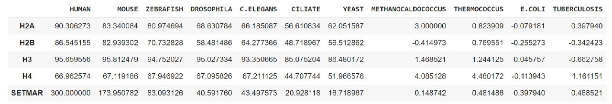

# Проект по биоинформатике. Индивидуальная часть

Гистоновая метка: **H3K36me**

Белок: **SETMAR**

# Описание белка

Белок SETMAR связан с механизмом репарации ДНК: NHEJ. Однако в сочетании с гистоновой меткой H3K36me2 данный механизм нарушается, что позволяет клеткам ранее пораженным глиобластомой избежать рецидива. Белок выполняет функцию Histone modification write.

## Inhibition of SETMAR–H3K36me2–NHEJ repair axis in residual disease cells prevents glioblastoma recurrence

https://academic.oup.com/neuro-oncology/article/22/12/1785/5847629

### Abstract

#### Background
Residual disease of glioblastoma (GBM) causes recurrence. However, targeting residual cells has failed, due to their inaccessibility and our lack of understanding of their survival mechanisms to radiation therapy. Here we deciphered a residual cell–specific survival mechanism essential for GBM relapse.

#### Methods
Therapy resistant residual (RR) cells were captured from primary patient samples and cell line models mimicking clinical scenario of radiation resistance. Molecular signaling of resistance in RR cells was identified using RNA sequencing, genetic and pharmacological perturbations, overexpression systems, and molecular and biochemical assays. Findings were validated in patient samples and an orthotopic mouse model.

#### Results
RR cells form more aggressive tumors than the parental cells in an orthotopic mouse model. Upon radiation-induced damage, RR cells preferentially activated a nonhomologous end joining (NHEJ) repair pathway, upregulating Ku80 and Artemis while downregulating meiotic recombination 11 (Mre11) at protein but not RNA levels. Mechanistically, RR cells upregulate the Su(var)3-9/enhancer-of-zeste/trithorax (SET) domain and mariner transposase fusion gene (SETMAR), mediating high levels of H3K36me2 and global euchromatization. High H3K36me2 leads to efficiently recruiting NHEJ proteins. Conditional knockdown of SETMAR in RR cells induced irreversible senescence partly mediated by reduced H3K36me2. RR cells expressing mutant H3K36A could not retain Ku80 at double-strand breaks, thus compromising NHEJ repair, leading to apoptosis and abrogation of tumorigenicity in vitro and in vivo. Pharmacological inhibition of the NHEJ pathway phenocopied H3K36 mutation effect, confirming dependency of RR cells on the NHEJ pathway for their survival.

#### Conclusions
We demonstrate that the SETMAR-NHEJ regulatory axis is essential for the survival of clinically relevant radiation RR cells, abrogation of which prevents recurrence in GBM.

### Экспрессия гена

### Домены

## Выравнивания гистонов

Выравнивания производились при помощи программы MEGA X

### H2A

Можно заметить, что последовательности довольно сильно отличаются, но при этом большая часть последовательностей совпадает, поэтому можно предположить, что они кодируют один и тот же ген. Остальные последовательности отличаются, возможно они похожи по пространственному строению.

### H2B

Можно заметить, что последовательности довольно сильно отличаются, но при этом большая часть последовательностей совпадает, поэтому можно предположить, что они кодируют один и тот же ген. Остальные последовательности отличаются, возможно они похожи по пространственному строению.

### H3

Фактически послежовательности почти полностью совпадают, можно считать, что они кодируют один и тот же ген.

### H4

Фактически послежовательности почти полностью совпадают, можно считать, что они кодируют один и тот же ген.

### Анализ протеом

Вся работа проведена в ноутбуке, необходимые данные находятся в папке data

https://colab.research.google.com/drive/18zKYU2XAvdnZdCkly4AwBReby0Kq7kaX?usp=sharing

#### e-value

#### -log10(e-value)

#### Heatmap

Заметим, что исследованные белок прослеживается только у человека и мыши, так что логично предположить, что впервые он появился у их общего предка.
